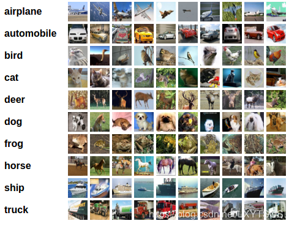
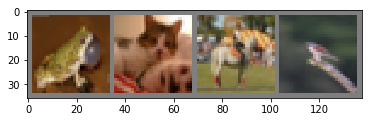

# TRAINING A CLASSIFIER 训练一个分类器

> 搜索微信公众号:'AI-ming3526'或者'计算机视觉这件小事' 获取更多算法、机器学习干货  
> csdn：https://blog.csdn.net/baidu_31657889/  
> github：https://github.com/aimi-cn/AILearners

> 译者注：本教程在pytorch官方教程的基础上翻译修改得到,代码输出是在本人在自己笔记本上运行之后放上去的，可能会和官方的输出结果有所不同，一切输出结果按照官方教程为准,原教程请点击[pytorch-official-tutorial](https://pytorch.org/tutorials/index.html)

现在我们已经知道如何定义网络结构，计算损失以及更新网络权重了，那么你现在回想，

## What about data? （关于数据怎么准备和处理？）

一般来说，处理图像、文本、语音或视频数据，我们可以直接使用Python的标准包将数据加载成numpy数组，然后将它转成torch.*Tensor。

- 对于图片数据，可以使用Pillow，OpenCV；
- 对于音频数据，可以使用scipy和librosa。
- 对于文本数据，可以使用基于原生Python或Cython的加载方式，或者使用NLTK和SpaCy包。

特别针对视觉处理，PyTorch提供了torchvision这个包，能够加载常用的数据集，比如ImageNet，CIFAR10，MNIST等，并且还有图像转换功能，我们可以使用这两个包来实现这些功能：torchvision.datasets，torch.utils.data.DataLoader。

这提供了极大的便利，避免了编写样板代码。

这里我们将使用CIFAR10数据集，包含这些类别：“airplane”，“automobile”，“bird”，”cat“，”deer“，”dog“，”frog“，”horse“，”ship“，”truck“，图片大小为3 * 32 * 32，即3通道的32 * 32图像。



## Training an image classifier （训练图像分类器）

我们将按照以下步骤进行：

- 使用torchvision加载、归一化CIFAR10训练、测试数据
- 定义卷积神经网络
- 定义损失函数
- 使用训练数据训练网络
- 使用测试数据测试网络

### 1.加载并且归一化CIFAR10

使用torchvision能非常便捷地加载CIFAR10。

```python
import torch
import torchvision
import torchvision.transforms as transforms
```

torchvision数据集的输出是PILImage类型的数据，范围[0,1]。然后我们将数据归一化到[-1,1]。

```python
# 归一化数据
transform = transforms.Compose(
    [transforms.ToTensor(),
     transforms.Normalize((0.5, 0.5, 0.5), (0.5, 0.5, 0.5))])
# 下载并加载训练集
trainset = torchvision.datasets.CIFAR10(root='./data', train=True,
                                        download=True, transform=transform)
trainloader = torch.utils.data.DataLoader(trainset, batch_size=4,
                                          shuffle=True, num_workers=2)
# 下载并加载测试集
testset = torchvision.datasets.CIFAR10(root='./data', train=False,
                                       download=True, transform=transform)
testloader = torch.utils.data.DataLoader(testset, batch_size=4,
                                         shuffle=False, num_workers=2)
# 具有的类别
classes = ('plane', 'car', 'bird', 'cat',
           'deer', 'dog', 'frog', 'horse', 'ship', 'truck')
```

输出：
```python
  0%|          | 0/170498071 [00:00<?, ?it/s]Downloading https://www.cs.toronto.edu/~kriz/cifar-10-python.tar.gz to ./data/cifar-10-python.tar.gz
170500096it [00:03, 46480718.55it/s]                               
Files already downloaded and verified
```

为了好玩，让我们展示一些训练图片。(真官方~)

```python
import matplotlib.pyplot as plt
import numpy as np

# functions to show an image


def imshow(img):
    img = img / 2 + 0.5     # unnormalize
    npimg = img.numpy()
    plt.imshow(np.transpose(npimg, (1, 2, 0)))
    plt.show()


# get some random training images
dataiter = iter(trainloader)
images, labels = dataiter.next()
imshow(torchvision.utils.make_grid(images))
print(' '.join('%5s' % classes[labels[j]] for j in range(4)))
```



输出：
```python
frog cat horse bird
```

### 2.Define a Convolutional Neural Network （定义卷积神经网络）

这里使用之前介绍的网络结构，但是将原本的1通道输入改成3通道输入：

```python
import torch.nn as nn
import torch.nn.functional as F


class Net(nn.Module):
    def __init__(self):
        super(Net, self).__init__()
        self.conv1 = nn.Conv2d(3, 6, 5)
        self.pool = nn.MaxPool2d(2, 2)
        self.conv2 = nn.Conv2d(6, 16, 5)
        self.fc1 = nn.Linear(16 * 5 * 5, 120)
        self.fc2 = nn.Linear(120, 84)
        self.fc3 = nn.Linear(84, 10)

    def forward(self, x):
        x = self.pool(F.relu(self.conv1(x)))
        x = self.pool(F.relu(self.conv2(x)))
        x = x.view(-1, 16 * 5 * 5)
        x = F.relu(self.fc1(x))
        x = F.relu(self.fc2(x))
        x = self.fc3(x)
        return x


net = Net()

```

### 3. Define a Loss function and optimizer （定义一个损失函数和优化器）

我们来使用交叉熵损失和带动量的SGD:

```python
import torch.optim as optim

criterion = nn.CrossEntropyLoss()
optimizer = optim.SGD(net.parameters(), lr=0.001, momentum=0.9)
```

### 4. Train the network （训练网络）

这里就是很有趣的地方啦，只需要简单的遍历数据集，将数据送给网络并且进行优化：

```python
for epoch in range(2):  # 多次遍历数据集

    running_loss = 0.0
    for i, data in enumerate(trainloader, 0):
        # 获得图像输入； 数据是一个列表 [输入, 标签类]
        inputs, labels = data

        # 梯度归零
        optimizer.zero_grad()

        # 前向传播，反向传播，更新优化参数
        outputs = net(inputs)
        loss = criterion(outputs, labels)
        loss.backward()
        optimizer.step()

        # 输出训练信息
        running_loss += loss.item()
        if i % 2000 == 1999:    # 每 2000 个batch输出一次
            print('[%d, %5d] loss: %.3f' %
                  (epoch + 1, i + 1, running_loss / 2000))
            running_loss = 0.0

print('Finished Training')
```

把后面的在gpu上训练搬过来大家看的更清楚 前面讲在cpu后面讲如何让在gpu上运算~~

### Training on GPU （在GPU上训练网络）

类似于将tensor放到GPU上，网络也同样能放到GPU上。
现在我们将第1块可用的CUDA设备定义为device：

```python
device = torch.device("cuda:0" if torch.cuda.is_available() else "cpu")

# 如果机器上有CUDA设备，那么这里应该会打印出对应的CUDA设备:

print(device)
```

```python
cuda:0
```

下面我们就假设设备在cuda环境下。

然后使用下面的方法，将会递归遍历所有的模块，将它们的参数，缓存都转成CUDA tensor。
```python
net.to(device)
```
记住同时也要将输入等也放到device设备上：
```python
inputs, labels = inputs.to(device), labels.to(device)
```

训练输出：

```python
[1,  2000] loss: 2.215
[1,  4000] loss: 1.886
[1,  6000] loss: 1.681
[1,  8000] loss: 1.549
[1, 10000] loss: 1.499
[1, 12000] loss: 1.454
[2,  2000] loss: 1.380
[2,  4000] loss: 1.356
[2,  6000] loss: 1.313
[2,  8000] loss: 1.303
[2, 10000] loss: 1.261
[2, 12000] loss: 1.242
Finished Training
```

我们加上时间对cpu和gpu训练时间进行测量~~~

```python
import time
start = time.clock()
##执行代码
end = time.clock()
t=end-start
print("Runtime is ：",t) 
## 输出时间
cpu: Runtime is ： 151.72370499999994
gpu：Runtime is ： 120.698012
```

### 5. Test the network on the test data

我们在数据集上迭代训练了2次，现在我们要看看网络是否学习到了东西。

我们需要使用网络的输出来得到预测的类别，并且和ground-truth进行对比，，如果预测正确，我们将这个样本加入正确预测的列表中。

现在和之前一样，我们看看测试数据：

```python
dataiter = iter(testloader)
images, labels = dataiter.next()

# print images
imshow(torchvision.utils.make_grid(images))
print('GroundTruth: ', ' '.join('%5s' % classes[labels[j]] for j in range(4)))
```


```python
GroundTruth:    cat  ship  ship plane
```

现在我们来看看网络的预测结果：

```python
outputs = net(images)
```

网络的输出是这10个类的置信度，一个类的置信度越高，说明网络认为图片属于这一类的可能性越大。所以我们获取最大置信度的类的下标：

```python
_, predicted = torch.max(outputs, 1)

print('Predicted: ', ' '.join('%5s' % classes[predicted[j]]
                              for j in range(4)))
```
```python
Predicted:    cat   car  ship plane
```

结果还不错。出现一个预测错误毕竟我们的网络就两层卷积。

让我们看看网络在整个数据集上表现的怎么样。

```python
correct = 0
total = 0
with torch.no_grad():
    for data in testloader:
        images, labels = data
        outputs = net(images)
        _, predicted = torch.max(outputs.data, 1)
        total += labels.size(0)
        correct += (predicted == labels).sum().item()

print('Accuracy of the network on the 10000 test images: %d %%' % (
    100 * correct / total))
```

```python
Accuracy of the network on the 10000 test images: 55 %
```
这看起来比随机猜的结果要好多了，随机猜测的准确率为10%，所以看起来网络学习到了一些东西。

那么，我们现在想看看网络在哪些类别上分类准确，哪些又没那么好：

```python
class_correct = list(0. for i in range(10))
class_total = list(0. for i in range(10))
with torch.no_grad():
    for data in testloader:
        images, labels = data
        outputs = net(images)
        _, predicted = torch.max(outputs, 1)
        c = (predicted == labels).squeeze()
        for i in range(4):
            label = labels[i]
            class_correct[label] += c[i].item()
            class_total[label] += 1


for i in range(10):
    print('Accuracy of %5s : %2d %%' % (
        classes[i], 100 * class_correct[i] / class_total[i]))
```

输出：

```python
Accuracy of plane : 74 %
Accuracy of   car : 78 %
Accuracy of  bird : 51 %
Accuracy of   cat : 29 %
Accuracy of  deer : 34 %
Accuracy of   dog : 44 %
Accuracy of  frog : 76 %
Accuracy of horse : 52 %
Accuracy of  ship : 59 %
Accuracy of truck : 52 %
```

ok，接下来呢？

怎么在GPU上运行神经网络呢？(我们之前已经先提到了~)

在多GPU上训练
如果希望使用您所有GPU获得更大的加速，请查看[Optional: Data Parallelism。](https://pytorch.org/tutorials/beginner/blitz/data_parallel_tutorial.html)

## Where do I go next? （接下来要做什么？）
- Train neural nets to play video games
- Train a state-of-the-art ResNet network on imagenet
- Train a face generator using Generative Adversarial Networks
- Train a word-level language model using Recurrent LSTM networks
- More examples
- More tutorials
- Discuss PyTorch on the Forums
- Chat with other users on Slack

笔记github地址~：[地址](https://github.com/aimi-cn/official-pytorch-tutorial)
